# AlignTTS (in progress...)
Implementation of the [AlignTTS](https://arxiv.org/abs/2003.01950)  

# Figures
## Losses  
### stage0  
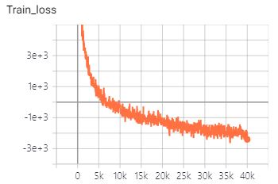 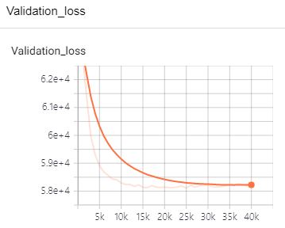  
### stage1  
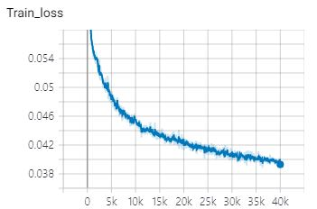 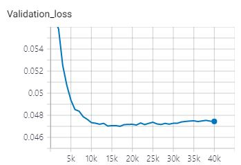  
### stage2  
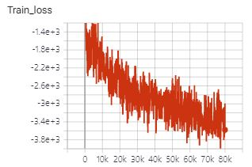 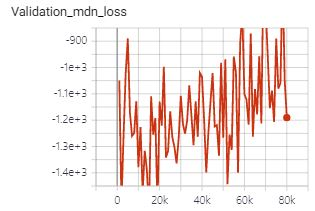 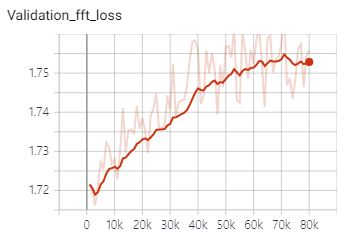  
### stage3  
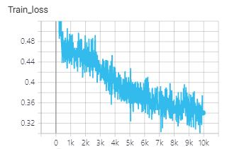 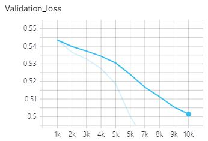  

## Alignments  
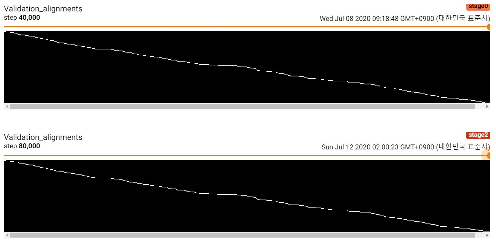  

## Melspectrograms  
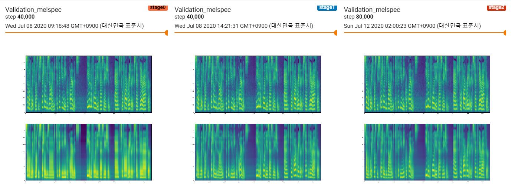  

## Losses  
## MDN Sample  
  

## Alignment Smaple
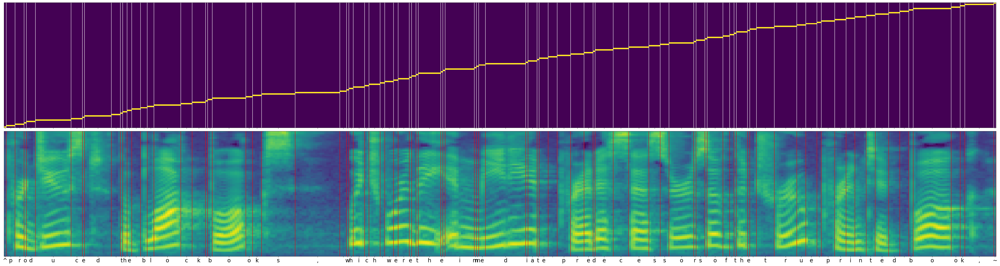  
